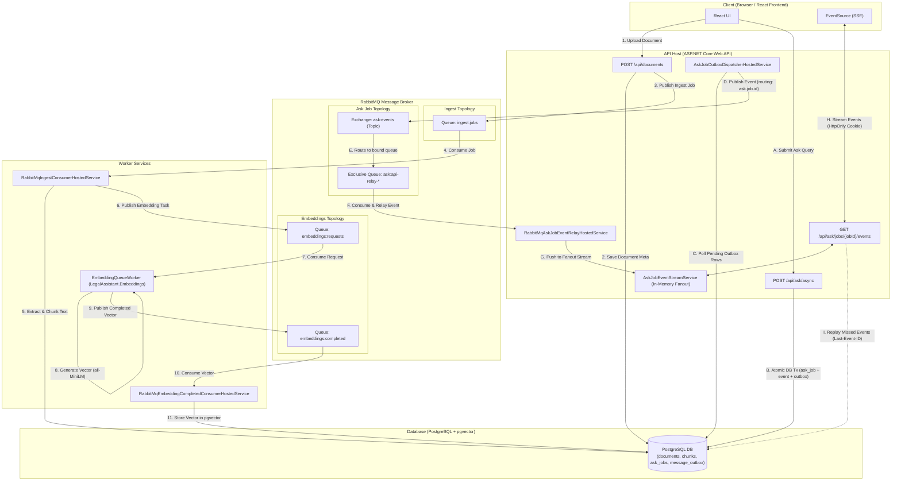

# RabbitMQ Architecture & Message Flow

**Date:** 2026-09-01  
**Project:** Legal Assistant  
**Document Purpose:** Complete specification and diagram of the RabbitMQ messaging pipeline and real-time SSE delivery architecture.

---

## 1. Overview & Topologies

Legal Assistant utilizes **RabbitMQ** for three main asynchronous workflow components:
1. **Document Ingestion Pipeline**: Handles document uploading, text extraction, normalization, and chunking.
2. **Embedding Pipeline**: Manages vector generation (`all-MiniLM-L6-v2`) and storage into PostgreSQL (`pgvector`).
3. **Ask Job Event Delivery**: Implements a Transactional Outbox pattern to deliver real-time job status updates via Server-Sent Events (SSE).

---

## 2. RabbitMQ Message Flow Diagram

---

## 3. Pipeline Breakdowns

### 3.1 Document Ingestion Flow
- **Endpoint**: `POST /api/documents`
- **Publisher**: `RabbitMqDocumentIngestJobPublisher`
- **Queue**: `ingest:jobs`
- **Consumer**: `RabbitMqIngestConsumerHostedService` in Worker project. Extracts document text, normalizes content, creates text chunks (~1000 tokens with 200 token overlap), and saves them to `document_chunks`.

### 3.2 Vector Embedding Flow
- **Publisher**: `RabbitMqEmbeddingRequestPublisher`
- **Request Queue**: `embeddings:requests`
- **Worker**: `EmbeddingQueueWorker` (`LegalAssistant.Embeddings` microservice). Computes dense embeddings using `all-MiniLM-L6-v2`.
- **Completion Queue**: `embeddings:completed`
- **Consumer**: `RabbitMqEmbeddingCompletedConsumerHostedService`. Persists generated vector arrays into the `embeddings` table (`pgvector`).

### 3.3 Real-Time SSE Outbox Flow
- **Endpoint**: `POST /api/ask/async`
- **Transactional Persistence**: Writes job state (`ask_jobs`), initial event (`ask_job_events`), and outbox entry (`message_outbox`) in a single DB transaction.
- **Outbox Dispatcher**: `AskJobOutboxDispatcherHostedService` reads pending outbox messages and publishes to RabbitMQ topic exchange `ask:events` with routing key `ask.job.<jobId>`.
- **Relay & SSE Stream**: `RabbitMqAskJobEventRelayHostedService` consumes from exchange via an exclusive API relay queue and feeds events to `AskJobEventStreamService`. Browser clients stream live status over `GET /api/ask/jobs/{jobId}/events` via `EventSource`.
